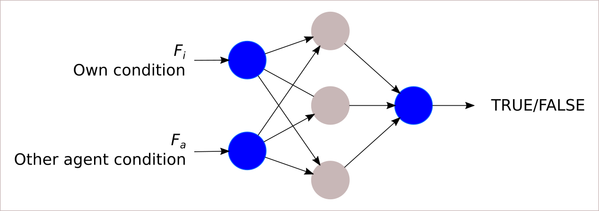

\linenumbers

# Introduction

Individuals with a general sense of the correct direction of travel, but few cues of prevailing conditions at their destination, must repeatedly make movements crucial to survival. The condition of conspecifics may reveal the best possible move in such circumstances. This information-transfer between individuals can result in the development of _leader -- follower_ dynamics, and more broadly, _movement social networks_.

This individual-based model studies the animal movement strategies evolved on landscapes with limited resource cues. The model is broadly based in the foraging ecology of central-place foragers. These individuals forage across the landscape, but regularly return to a resting site (the 'central place'). When multiple individuals return to the same site, (eg. vultures [@harelroi2017], or waders [@bijleveld2010]), information-centres [@ward1973] may develop as individuals gain indirect resource cues from the success of group members.

# Dynamics in brief

## Ecological timescale

The simulation landscape is wrapped and one-dimensional, similar to the perimeter of a circle. Agents are gathered at the centre of this circle. In each timestep, agents must choose a position on the perimeter at which to place themselves. Agents then make a finite number of choices of whether to _exploit the resources_ at their position, or to _explore along the perimeter_ for a better spot. At the end of the timestep agents return to their roost at the centre of the circle. Agents _remember their last exploited position_. 

At the beginning of the next timestep, agents are randomly shuffled into a departure queue. As the first agent departs, all other agents _assess whether to follow_. Agents that choose to follow also depart, adopting the initial foraging position of the _leader_. The remaining agents in the queue repeat this process until only a single agent remains, which departs alone.

## Evolutionary timescale

At the end of a certain number of timesteps, the population reproduces asexually, maintaining a fixed size. Each agent has a number of offspring proportional to its share of total population intake. Offspring inherit the decision-making mechanism of their parent.

The landscape recovers from the previous generation's depletion to its default value, mimicking resource regrowth.

# Landscape

## Landscape attributes 
The resource landscape is the quasi-continuous perimeter of a circle. Resource values are stored at a large number of discrete points along the perimeter, allowing for fine-scale linear interpolation at any continuous point.

## Landscape dynamics

The landscape is initialised with uniform values at all discrete points.

The landscape is depleted by agent exploitation. Agents choose to exploit at a continuous position. The depletion effect of an agent at any landscape point around its position is related to the distance of the landscape point from the agent position. An efficient sigmoid-like interpolation [Hermite-interpolation using _smootherstep_, see @ebert2003] is applied on the distance as follows. 

_Smootherstep_ allows detailed control of the depletion effect of an agent, which may be useful in mimicking the non-exploitative reduction in resources due to consumer presence. This includes setting two threshold values beyond which agents have no effect (depletion range), and within which maximum allowed extraction takes place (dead zone) (Figure 1). Each depletion event is limited to a fraction of the available resources; this reflects the increasing difficulty in finding dwindling resources.

$$ \operatorname{depletion}(x) = P_{food} \times \begin{cases}
1                    & x \le \operatorname{dead \ zone} \\
6x^5 - 15x^4 + 10x^3 & \operatorname{dead \ zone} \le x \le  \operatorname{depletion \ range} \\
0                    & \operatorname{depletion \ range} \le x \\
\end{cases} $$

Here, $x$ is the wrapped absolute distance between any landscape point and the agent position, and $P_{food}$ is the proportion of available resources depleted.

There is no resource replenishment within a generation, and within-generation heterogeneity in resource values arises from agent foraging. The landscape is replenished by a fixed value each generation, with a fixed carrying capacity, leading to between-generation heterogeneity.

# Agents

## Agent attributes

The population consists of a fixed number of individuals. Each individual stores the following information, which is used and updated during the simulation:

- ANN: An artificial neural network used to assess other individuals.
- Circular position: A value (0.0 -- 1.0) representing a position on the wrapped linear landscape. Initially randomly chosen.
- Explore/exploit trade-off: A heritable value (0.0 -- 1.0) representing the probability of exploiting a resource value.
- Leader identity: The identity of the agent chosen to follow, if any.

## Agent dynamics

Each agent makes a single initial movement in each timestep from the roost to a point on the landscape (circular position). Agents are created with a position drawn from a uniform distribution.

When making the initial _roost-landscape movement_, the population is shuffled into a _movement queue_. The first individual in the queue is assumed to be independent, and has no leader (Figure 2). All subsequent individuals in the queue must assess whether to follow this _movement queue leader_ to its position on the landscape. This assessment is described below. The leader and any followers are removed from the movement queue. The remaining agents are shuffled again to form another movement queue, and the first agent becomes the new movement queue leader. The process above repeats until only a single agent remains in the queue, which is assumed to have no choice but to be independent.

Having made the roost-landscape movement, agents make an _exploration-exploitation trade-off_ over a fixed number of foraging turns, based on the inherited trade-off parameter (Figure 3). The trade-off is made until the first (probabilistic) decision to exploit, or until turns run out. Agents take in resources for as many turns as remain after choosing to exploit. For turns in which an agent chooses to explore, it performs a random walk with a step-length 1.0% of landscape size, and updates its circular position. Agents that never exploit are assumed to have no intake. Agents 'memorise' their (new) circular position when they return to the roost at the end of the timestep.

![The exploration-exploitation dynamic and agent movement along the landscape. In step 1, an agent moves to its initial position on the landscape $P_I$. From there, it executes a random-walk with a probability of stopping to exploit specified by the exploration-exploitation trade-off parameter (dashed blue lines), until it stops to exploit (red circle, final position $P_F$). After returning to the roost, the agent, if independent, will return to the previous final position as the new initial position.](fig_circmove.png)

At the beginning of the next timestep, an independent agent with no leader moves to the most recently memorised landscape position. In contrast, follower agents move to the position of their leader, as described above.

Agents are modelled as asexually reproducing, with a fixed population size. Total agent intake over a generation is used as a proxy for fitness, and is always >= 0. A new population is generated before the old one is destroyed. 
The neural network node weights and inherited movement parameter of an agent _j_ in the new population are set to be the same as those of an agent _i_ in the old population, which is considered to be the parent. The probability of any agent _i_ being chosen as the parent is proportional to its share of the total intake of the population.
The neural network weights and movement parameter values of the new generation undergo random mutation at a very low rate, 0.001. The value by which each weight, or the movement value is mutated is drawn from a Cauchy distribution around the original value.

## Leader assessment

Agent assessment is performed by an artificial neural network with 2 input nodes, a single hidden layer of 3 nodes, and one output node (Figure 4). All node values are initialised at 0. 
The two input nodes are provided the assessing agent’s own condition, $F_i$, and the assessed agent’s condition $F_a$; $F_i$ and $F_a$ are the summed intakes of the two agents respectively. These may be thought of as body condition, number of juveniles, return time, or some other indicator of foraging success. The single output node returns a floating point value which is assessed as either TRUE (follow) when greater than 0.0, and FALSE (do not follow) otherwise.

# Questions

We aim to answer the following questions:

1. Does the population achieve higher total fitness when information transfer is allowed? Do the observed dynamics change when the population has > 1 roosting site?
2. How does the proportion of followers to leaders change over ecological and evolutionary timescales? 
3. Is the leader-follower dynamic correlated with the explore-exploit trade-off?

# Model parameters

Paramter| Value | Example/Interpretation
--- | --- | ---
**Population**||
Generations|1000|
Timesteps|10|Tidal cycle, foraging trip
Population|100, 1000, 10000|
**Landscape**||
Discretisation points|100|
Max resource|10.0|Res. carrying capacity
Res. regrowth|Max/2, variable|
Foraging turns|5|Tidal cycle duration
Fraction resource depleted|0.01|
**Artificial neural network**||
ANN weights|0.0|
Mutation value|0.001|
Mutation shape|0.1 Cauchy distribution|
Architecture|2 – 3 – 1|
Node function|Rectified linear activation|
Network type|Simple feed-forward|

# References
